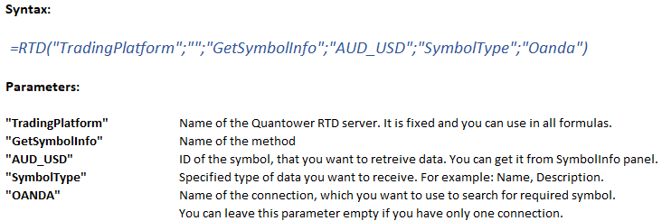

# Excel and RTD function

Start from the version 1.39 Quantower supports RealTimeData \(RTD\) for sending data and other market information to Microsoft Excel®. This feature opens up many opportunities for creating custom displays and other ways to better manage your workflow.

RTD is a newer protocol that offers several advantages over DDE, including more flexibility and better performance and reliability.

We prepared the spreadsheet that outlines the basic syntax of RTD formulas with details more complex formulas. Included is a collection of popular RTD formulas, which you can simply copy and paste into your own spreadsheet. [**Download the sample file**](https://updates.quantower.com/misc/RTD/rtd_samples.xlsx)**.**

Here is the General Syntax for getting symbol info via RTD function:



## **How to activate RTD function in Quantower platform**

Go to the [**General Settings**](../getting-started/general-settings.md) of the platform, then to _section **Excel RTD**_ and tick off _**"Enable Microsoft Excel RTD"**_


Also in the settings there are two important settings:

* **Custom RTD formula name** — depending on the language of your operating system, the name of the RTD function in Excel may be called differently. The original name of the function in the English version of Excel is RTD, but for Russuian version it's called as "ДРВ".
* **Custom argument separator** — the separator that participates in the formula. It depends on the localization of your operating system. Get to know [how to check argument separator in your system](excel-rtd-trading.md#how-to-check-argument-separator).

## How to retrieve the instrument data from Quantower?

When retrieving instrument data using RTD, you need to specify the ID of the instrument and the properties you want to retrieve.

RTD formula uses the following basic structure:

```text
=RTD("TradingPlatform";"";"Param1";"Param2";"Param3";....")
```


The second parameter is the name of the external server running the RTD Server. As the Quantower RTD Server always runs locally, you must omit a value for the second parameter or supply an empty string \(“”\). However, you must account for the parameter in the formula.


## **Frequently Asked Questions**

### **How to check argument separator?**

For Windows 7:

* go to **Start &gt; Control Panel &gt; Regional and Language Options**
* Click on **Formats Tab** **&gt; Additional Settings**
* for **List Separator** check the argument. _\*\*_It must be the same as in RTD settings.

For Windows 10:

* go to **Start &gt;type Control Panel  and press enter &gt; Region**
* click **Additional Settings**
* for **List Separator** check the argument. _\*\*_It must be the same as in RTD settings.


